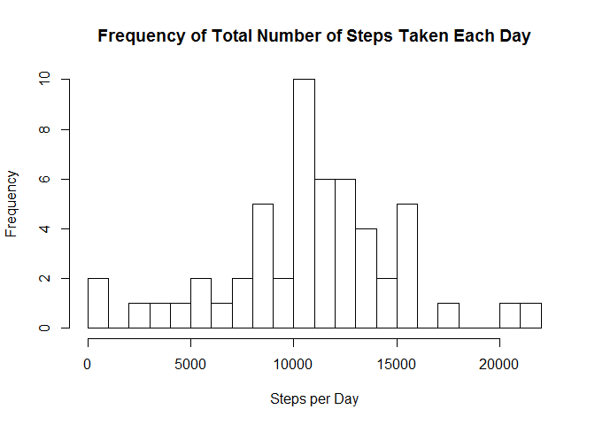
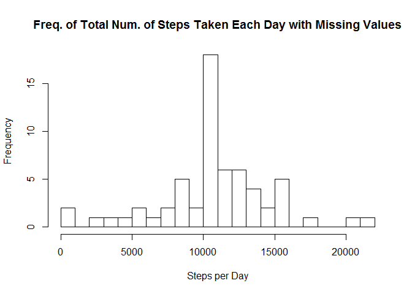
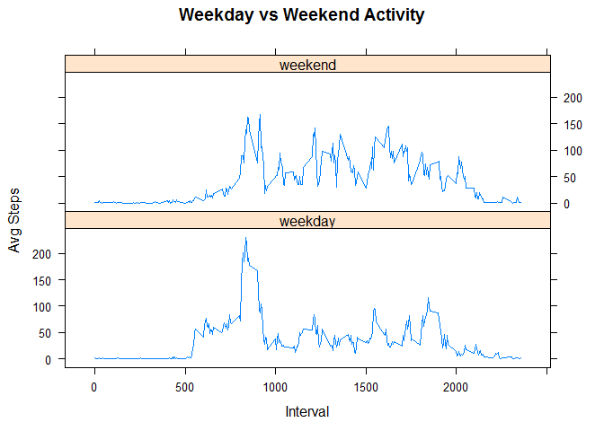

# PA1_template.Rmd
Chris  
January 14, 2017  
 


## Part 1: Loading and preprocessing the data

First the activity file needs to be unzipped and read in


```r
#Load Libraries 
library(knitr)
library(dplyr)
library(lattice)

#Read in Data
x_all <- read.csv(unzip("activity.zip"))

#Remove N/A values
x <- na.omit(x_all)
```

## Part 2: What is mean total number of steps taken per day?

Calculate the total number of steps taken per day

```r
day <- group_by(x, date)
steps_each_day <- summarise(day, steps_day = sum(steps))
```

Make a histogram of the total number of steps taken each day

```r
hist(steps_each_day$steps_day, breaks = 20, main = "Frequency of Total Number of Steps Taken Each Day", xlab="Steps per Day")
```

<!-- -->

Calculate and report the mean and median of the total number of steps taken per day

```r
mean(steps_each_day$steps_day)
```

```
## [1] 10766.19
```

```r
median(steps_each_day$steps_day)
```

```
## [1] 10765
```


## Part 3: What is the average daily activity pattern?

Make a time series plot (i.e. type = "l") of the 5-minute interval (x-axis) and the average number of steps taken, averaged across all days (y-axis)

```r
interval_steps <- group_by(x, interval)
avg_steps_interval <- summarise(interval_steps,avgsteps = mean(steps))
plot(avg_steps_interval$interval, avg_steps_interval$avgsteps, type= "l", main = "Time Series plot of Intervals and Avg Steps Taken", xlab = "Interval", ylab= "Avg Steps")
```

<!-- -->

Which 5-minute interval, on average across all the days in the dataset, contains the maximum number of steps?

```r
avg_steps_interval[which(avg_steps_interval$avgsteps == max(avg_steps_interval$avgsteps)),]$interval
```

```
## [1] 835
```


## Part 4: Inputing missing values

Calculate and report the total number of missing values in the dataset (i.e. the total number of rows with NAs)

```r
sum(is.na(x_all$steps))
```

```
## [1] 2304
```

Devise a strategy for filling in all of the missing values in the dataset. The strategy does not need to be sophisticated. For example, you could use the mean/median for that day, or the mean for that 5-minute interval, etc.

Create a new dataset that is equal to the original dataset but with the missing data filled in.

```r
#Copy original data set
x_noNA <- x_all

#Fill NA Values with average steps for interval
for(i in 1:nrow(x_all)) {
  if(is.na(x_all$steps[i])) {
    
    x_noNA$steps[i] <- avg_steps_interval$avgsteps[which(avg_steps_interval$interval == x_all$interval[i])]
  }
     
}
```


Make a histogram of the total number of steps taken each day and Calculate and report the mean and median total number of steps taken per day. Do these values differ from the estimates from the first part of the assignment? What is the impact of imputing missing data on the estimates of the total daily number of steps?

```r
day_noNA <- group_by(x_noNA, date)
steps_each_day_noNA <- summarise(day_noNA, steps_total = sum(steps))

#Make a histogram of the total number of steps taken each day

hist(steps_each_day_noNA$steps_total, breaks = 20, main = "Freq. of Total Num. of Steps Taken Each Day with Missing Values", xlab="Steps per Day")
```

<!-- -->

Calculate and report the mean and median of the total number of steps taken per day

```r
mean(steps_each_day_noNA$steps_total)
```

```
## [1] 10766.19
```

```r
median(steps_each_day_noNA$steps_total)
```

```
## [1] 10766.19
```
These values are close to the estimates from the first part of the assignment. The histograms look similar. The only change is in the median which resulted in a slight increase from 10765 to 10766.19. The impact of inputing missing data on the estimates of the total daily number of steps is not large.


##Part 5: Are there differences in activity patterns between weekdays and weekends?

Create a new factor variable in the dataset with two levels - "weekday" and "weekend" indicating whether a given date is a weekday or weekend day.


```r
#Update class to Date
x_noNA$date = as.Date(x_noNA$date)
#Determine if Weekend of Weekday
x_noNA_Date <- x_noNA 

for(i in 1:nrow(x_noNA_Date)) {
  if(weekdays(x_noNA_Date$date[i])=="Saturday" || weekdays(x_noNA_Date$date[i])=="Sunday") {
     
    x_noNA_Date$Day[i] <- ("weekend")  
  } else {
      x_noNA_Date$Day[i] <- ("weekday")  
    }
     
}
```

Make a panel plot containing a time series plot (i.e. type = "l") of the 5-minute interval (x-axis) and the average number of steps taken, averaged across all weekday days or weekend days (y-axis).

```r
interval_day_steps <- group_by(x_noNA_Date, interval, Day)
avg_steps_interval_day <- summarise(interval_day_steps,avgsteps = mean(steps))
xyplot(avg_steps_interval_day$avgsteps ~ avg_steps_interval_day$interval | factor(avg_steps_interval_day$Day), type='l', layout=c(1,2), main = "Weekday vs Weekend Activity", xlab='Interval', ylab='Avg Steps')
```

<!-- -->

There appears to be more activity in the afternoon and night during the weekends compared to weekdays.
